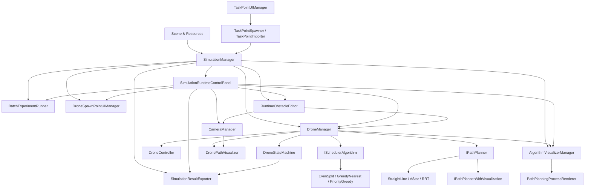

# 系统架构

## 1. 设计目标

当前架构围绕两个核心目标展开：

- 把调度算法和路径规划算法封装为可替换模块。
- 把算法运行纳入完整仿真闭环，而不是停留在离线计算结果。

因此，系统不是“算法直接驱动物体移动”的单层结构，而是“仿真控制层 + 无人机管理层 + 算法接入层 + 可视化与数据层”的分层架构。

## 2. 系统分层

| 层级 | 主要内容 | 代表文件 | 作用 |
| --- | --- | --- | --- |
| 场景与资源层 | 主场景、sandbox 场景、城市环境、任务 CSV、默认配置、实验预设 | `Assets/Scenes/Main/MainScene.unity`、`Assets/Scenes/Sandbox/CustomObstacleSandbox.unity`、`Assets/Resources/*` | 提供运行资源和默认数据 |
| 交互与界面层 | 场景 Canvas、运行时控制面板、任务点/起飞点/障碍物交互、统一 UI 输入拦截 | `TaskPointUIManager.cs`、`DroneSpawnPointUIManager.cs`、`RuntimeObstacleEditor.cs`、`SimulationRuntimeControlPanel.cs`、`UIInputGate.cs` | 提供用户输入入口并屏蔽 UI 悬停时的场景滚轮/视角输入 |
| 仿真控制层 | 仿真状态管理、运行时入口挂接 | `SimulationManager.cs` | 串联开始、暂停、重置和主流程 |
| 业务控制层 | 机群生成、任务分配、路径规划调用、碰撞占位、可视化挂接 | `DroneManager.cs` | 系统主控制枢纽 |
| 过程可视化层 | 规划过程记录、播放控制、步骤过滤、场景渲染 | `AlgorithmVisualizerManager.cs`、`PathPlanningProcessRenderer.cs`、`PathPlanningVisualizationRecorder.cs` | 在不侵入算法求解逻辑的前提下展示搜索过程 |
| 单机执行层 | 单机移动控制和任务状态推进 | `DroneController.cs`、`DroneStateMachine.cs` | 将任务和路径变成飞行行为 |
| 算法接入层 | 调度接口、规划接口及其实现 | `ISchedulerAlgorithm.cs`、`IPathPlanner.cs` 等 | 封装可替换算法能力 |
| 数据与导出层 | 统计模型、CSV/JSON 导出、批量实验归档 | `SimulationResultExporter.cs`、`BatchExperimentRunner.cs`、`Model/*` | 生成结果证据链 |
| 编辑器工具层 | 资产初始化、场景导入、烟雾验证、打包、测试入口 | `Assets/Editor/*` | 支持交付、维护和验证 |

## 3. 核心模块关系



## 4. 关键模块说明

### 4.1 SimulationManager

职责：

- 管理系统级状态 `Idle / Running / Paused`
- 处理开始、暂停、重置
- 在启动时收集任务点并触发任务分配
- 自动补齐运行时控制面板、结果导出器、批量实验器、起飞点管理器和自定义障碍物编辑器引用

关键特点：

- 系统总入口
- 负责把“用户点击开始”转换成“任务分配 + 运行态切换”

### 4.2 DroneManager

职责：

- 生成和重建机群
- 保存 `DroneData`
- 调用调度器和规划器
- 自动配置障碍物层和建筑代理碰撞体
- 提供运行时自定义障碍物容器与障碍刷新入口
- 在路径规划时创建过程记录器并把轨迹注册给可视化管理器
- 统一控制路径显示和 2D 投影
- 提供建筑 footprint 检测

关键特点：

- 是仿真系统的核心业务控制层
- 既连接算法，也连接场景、可视化和状态机

### 4.3 AlgorithmVisualizerManager + PathPlanningProcessRenderer

职责：

- 统一管理路径规划过程轨迹的注册、播放、暂停、单步、重置、倍速和模式切换
- 维护 `仅最终结果 / 完整过程 / 关键步骤` 三种演示模式
- 把统一步骤事件渲染为节点、边、候选路径、回溯路径和最终路径
- 输出当前算法名称、当前步骤、播放状态、说明文本和图例说明

关键特点：

- 通过 `IPathPlannerWithVisualization` + `PathPlanningVisualizationRecorder` 把算法求解和可视化播放解耦
- `PathPlanningProcessRenderer` 只负责表现，不负责推进步骤
- 当前按“单次规划、单架无人机”视角回放，适合答辩演示和调试过程观察

### 4.4 RuntimeObstacleEditor + SimulationRuntimeControlPanel

职责：

- 提供自定义障碍物的绘制、删除、清空、样式切换、缩放和高度调整入口
- 约束障碍物编辑只能发生在 `Idle` 状态
- 检查新障碍物与现有建筑、任务点、起飞点的重叠
- 在障碍布局变化后触发 `DroneManager.RefreshObstacleConfiguration`

关键特点：

- 通过 `RuntimeObstacleCatalog` 复用现成长方体和城市楼体模板，统一作用于预览、重叠校验和最终生成尺寸
- 当前自定义障碍物是运行时会话级对象，适合演示和实验，不等同于完整地图编辑器
- 自定义障碍物与现有路径规划、建筑告警和起飞点/任务点系统直接复用同一套主链路

### 4.4.1 UIInputGate + CameraManager

职责：

- `UIInputGate` 统一判断当前鼠标是否悬停在可交互 UI 或普通面板区域上
- `CameraManager`、`TaskPointUIManager`、`DroneSpawnPointUIManager` 和 `RuntimeObstacleEditor` 统一复用该判断结果
- 在用户滚动运行时面板、Scroll View、输入框和下拉控件时阻止场景相机继续响应滚轮

关键特点：

- 采用统一入口而不是在每个面板里单独打补丁
- UI 滚动、输入和点击体验保留，场景缩放/视角控制仅在非 UI 区域生效
- 该机制属于交互层能力，不影响调度、规划或导出主链路

### 4.5 DroneStateMachine + DroneController

职责：

- `DroneStateMachine` 推进任务执行状态
- `DroneController` 执行底层位移

状态划分：

- 系统状态：`Idle / Running / Paused`
- 单机状态：`Idle / Moving / Waiting / Finished`

关键特点：

- 当前局部避让逻辑在 `DroneStateMachine` 中
- 移动控制不依赖真实刚体推进，而是脚本驱动位置更新

### 4.6 算法接入层

调度接入：

- 接口：`ISchedulerAlgorithm`
- 请求：`SchedulingRequest`
- 返回：`SchedulingResult`

规划接入：

- 接口：`IPathPlanner`
- 过程扩展接口：`IPathPlannerWithVisualization`
- 请求：`PathPlanningRequest`
- 返回：`PathPlanningResult`

关键特点：

- `DroneManager` 通过枚举选择算法实现
- 算法模块不直接操作 UI、相机或导出
- 算法只负责输入到输出，系统层负责调用、展示和记录
- 需要过程演示的规划器只输出步骤事件，不直接控制播放与渲染

### 4.7 结果与实验层

职责：

- 记录单次运行摘要
- 导出 JSON 明细
- 组织按日期和会话归档
- 执行批量实验
- 输出 `session_manifest.json` 和 `session_summary.csv`

关键特点：

- 已形成“运行 -> 导出 -> 归档”的结果链路
- 仍未内置结果回放和图表展示

## 5. 数据流

## 5.1 单次仿真数据流

1. 用户配置任务点、起飞点、自定义障碍物、算法和规划参数
2. `SimulationManager.OnStartClicked`
3. `DroneManager.AutoAssignTasks` 构建 `SchedulingRequest`
4. 调度器返回 `SchedulingResult`
5. 分配结果写入每架无人机的 `DroneData.taskQueue`
6. `DroneStateMachine` 为当前任务构建 `PathPlanningRequest`
7. 规划器返回 `PathPlanningResult`
8. 路径写入 `DroneData.plannedPath`
9. `DroneController` 按状态机控制飞行
10. `DronePathVisualizer` 和 `CameraManager` 负责路径与视角显示
11. `SimulationResultExporter` 汇总统计并导出

## 5.2 路径规划过程可视化数据流

1. `DroneStateMachine` 请求当前任务路径
2. `DroneManager` 创建 `PathPlanningVisualizationRecorder`
3. 支持过程记录的规划器通过 `IPathPlannerWithVisualization` 输出步骤事件
4. `PathPlanningVisualizationRecorder` 生成 `PathPlanningVisualizationTrace`
5. `AlgorithmVisualizerManager` 注册轨迹并构建播放序列
6. `SimulationRuntimeControlPanel` 控制当前无人机、模式、速度和播放状态
7. `PathPlanningProcessRenderer` 渲染节点扩展、候选边、回溯路径和最终路径

## 5.3 批量实验数据流

1. 用户选择实验预设或使用当前配置
2. `BatchExperimentRunner.StartBatch`
3. 每轮执行 `Reset -> ApplyPreset -> Start -> WaitForComplete -> Export`
4. `SimulationResultExporter` 记录每轮 CSV/JSON
5. 批量结束后写入 `session_manifest.json` 和 `session_summary.csv`

## 5.4 2D 轨迹检查数据流

1. 用户切换 `2D俯视`
2. `CameraManager` 启用顶视投影模式
3. `DroneManager` 把路径显示切换到统一投影高度
4. `DronePathVisualizer` 基于建筑 footprint 检查当前位置和线段
5. 若命中建筑投影，则切换告警样式并增加摘要中的建筑告警计数

## 5.5 自定义障碍物编辑数据流

1. 用户在运行时控制面板切换到 `绘制` 或 `删除`
2. `RuntimeObstacleEditor` 从当前相机向地面发射射线
3. 绘制模式下根据拖拽起点/终点生成障碍物包围盒
4. 与现有建筑、任务点、起飞点做重叠校验
5. 通过校验后在 `Buildings/RuntimeObstacles` 下创建建筑，并刷新 `DroneManager` 的障碍配置
6. 路径规划、`2D俯视` footprint 检查和右侧摘要立即复用新的障碍布局

## 6. 算法模块如何与系统集成

### 6.1 调度算法集成方式

调度算法不直接访问场景对象，而是通过 `SchedulingRequest` 获得：

- 无人机数据列表
- 任务点列表
- 默认起点
- 优先级、距离、负载权重
- 单机任务容量限制

返回结果后，由 `DroneManager` 将 `SchedulingResult.assignments` 写回无人机任务队列。

### 6.2 路径规划算法集成方式

路径规划算法通过 `PathPlanningRequest` 获得：

- 起点和终点
- 规划边界
- 网格尺寸
- 障碍层
- 是否允许对角

返回路径后，由 `DroneStateMachine` 按 waypoint 顺序推进。
若规划器实现了 `IPathPlannerWithVisualization`，则会把搜索步骤同步输出到统一过程可视化轨迹中。

### 6.3 集成约束

- 算法模块目前以 `XZ` 平面为主，属于二维规划在三维场景中的投影表达。
- 算法模块不关心 UI 和导出逻辑。
- 算法模块由系统层负责切换、调用和记录。

## 7. 关键流程

## 7.1 启动仿真

```text
用户点击开始
-> SimulationManager 检查状态并重置必要数据
-> 收集 TaskPoint
-> DroneManager 调度分配
-> 状态切换为 Running
-> DroneStateMachine 请求路径并开始执行
```

## 7.2 重置仿真

```text
用户点击重置
-> DroneManager.ResetAllDrones
-> TaskPoint.ResetTask
-> SimulationResultExporter.ResetRunTracking
-> SimulationManager 切回 Idle
```

## 7.3 重建机群

```text
用户修改无人机数量
-> DroneManager.RespawnDrones
-> 重新创建 DroneController / DroneStateMachine / DronePathVisualizer
-> CameraManager 重新绑定机群
```

## 7.4 编辑自定义障碍物

```text
用户在右侧面板点击绘制
-> RuntimeObstacleEditor 进入拖拽模式
-> 鼠标拖拽生成候选包围盒
-> 校验与建筑/任务点/起飞点是否重叠
-> 创建 RuntimeObstacle 并刷新 DroneManager 障碍缓存
```

## 7.5 导出结果

```text
用户手动导出或单轮结束自动导出
-> SimulationResultExporter 汇总任务、无人机、规划和相机信息
-> 生成 CSV 记录或 JSON 明细
-> 写入按日期和会话组织的目录
```

## 8. 当前架构结论

当前架构已经满足毕业设计“系统设计与实现”的基本要求：

- 有明确分层
- 有统一算法接口
- 有主流程控制层
- 有运行时交互层
- 有数据导出和测试入口

但仍有两个边界需要在文档中明确：

- 多机避让仍是业务逻辑级补偿，不是独立协同规划子系统。
- 结果展示强项在运行时可视化、路径规划过程回放和文件导出，不在独立结果对比与图表面板。
- 当前只支持运行时会话级自定义障碍物编辑，不支持运行时多场景切换或障碍布局持久化。
